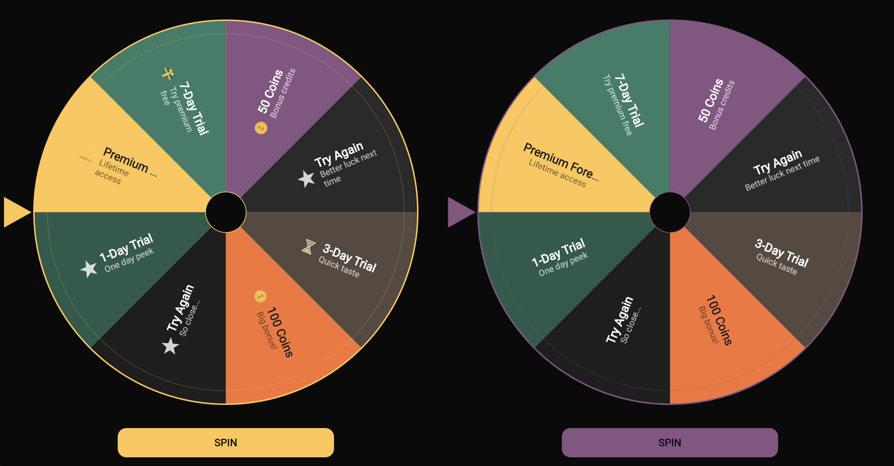

# Compose Roulette

**A spin-to-win roulette wheel for Compose Multiplatform.**
Pure Canvas. No images. No third-party libs. Just vibes and equal-odds randomness.

> *"You miss 100% of the spins you don't take."* — Wayne Gretzky, probably


[](https://jitpack.io/#Artificialss/ComposeRoulette)

---

## Preview



*Left: `RouletteWheel` (with icons) — Right: `RouletteWheelSimple` (text only)*

---

## Two Flavors

### `RouletteWheel` — with icons
Each segment shows: **icon** (left) + **name** (bold, 1 line) + **description** (2 lines max).
If you don't pass an icon, you get a default star. You're welcome.

### `RouletteWheelSimple` — text only
Same `Prize` object, icon field ignored. Just centered bold name + description.
For when you want the wheel to feel *classy*.

---

## Installation

### JitPack (recommended)

Add JitPack to your repositories:

```kotlin
// settings.gradle.kts
dependencyResolutionManagement {
    repositories {
        google()
        mavenCentral()
        maven("https://jitpack.io")
    }
}
```

Add the dependency:

```kotlin
// build.gradle.kts
commonMain.dependencies {
    implementation("com.github.Artificialss.ComposeRoulette:roulette:1.0.2")
}
```

### Maven Local

```bash
git clone git@github.com:Artificialss/ComposeRoulette.git
cd ComposeRoulette
./gradlew :roulette:publishToMavenLocal
```

Then in your project:

```kotlin
// settings.gradle.kts
dependencyResolutionManagement {
    repositories {
        mavenLocal()
        // ...
    }
}

// build.gradle.kts
commonMain.dependencies {
    implementation("com.artificialss:roulette:1.0.2")
}
```

### Composite Build (local development)

```kotlin
// settings.gradle.kts
includeBuild("../ComposeRoulette") {
    dependencySubstitution {
        substitute(module("com.artificialss:roulette")).using(project(":roulette"))
    }
}

// build.gradle.kts
commonMain.dependencies {
    implementation("com.artificialss:roulette")
}
```

---

## Quick Start

```kotlin
// 1. Define your prizes
val prizes = listOf(
    Prize("gold", "Premium Forever", "Lifetime access", Color.Gold, icon = { CrownIcon() }),
    Prize("trial", "7-Day Trial", "Try premium free", Color.Green),
    Prize("lose", "Try Again", "Better luck next time", Color.DarkGray, tryAgain = true),
)

// 2. Create state + render
val state = rememberRouletteState(prizes.size)
val scope = rememberCoroutineScope()

RouletteWheel(
    prizes = prizes,
    state = state,
    onResult = { prize -> println("Won: ${prize.name}") }
)

// 3. Spin
Button(onClick = {
    scope.launch {
        val winnerIndex = state.spin()
        val winner = prizes[winnerIndex]
        if (winner.tryAgain) { /* let them spin again */ }
        else { /* grant the prize */ }
    }
}) { Text("SPIN") }
```

---

## The `Prize` Object

```kotlin
data class Prize(
    val id: String,              // Unique ID for result handling
    val name: String,            // Bold title, 1 line, ellipsis if too long
    val description: String,     // Subtitle, 2 lines max, ellipsis
    val color: Color,            // Segment background
    val textColor: Color,        // Text color (default: White)
    val icon: (@Composable () -> Unit)?,  // Optional icon composable (null = default star)
    val tryAgain: Boolean        // If true, the consumer should allow re-spin
)
```

| Field | Required | Default | Notes |
|-------|----------|---------|-------|
| `id` | Yes | — | Use it to identify the result |
| `name` | Yes | — | 1 line, bold, ellipsis overflow |
| `description` | No | `""` | 2 lines max, 70% alpha |
| `color` | No | Dark gray | Segment background |
| `textColor` | No | White | — |
| `icon` | No | Default star | Ignored by `RouletteWheelSimple` |
| `tryAgain` | No | `false` | Signal the consumer to allow re-spin |

**All prizes have equal probability. Always. No weighting.**

---

## Composable Functions

### `RouletteWheel` (with icons)

```kotlin
@Composable
fun RouletteWheel(
    prizes: List<Prize>,
    state: RouletteState,
    onResult: (Prize) -> Unit = {},
    style: RouletteStyle = RouletteStyle(),
    modifier: Modifier = Modifier
)
```

### `RouletteWheelSimple` (text only)

```kotlin
@Composable
fun RouletteWheelSimple(
    prizes: List<Prize>,
    state: RouletteState,
    onResult: (Prize) -> Unit = {},
    style: RouletteStyle = RouletteStyle(),
    modifier: Modifier = Modifier
)
```

**Auto-adaptive:**
- Fills available space with 15dp padding
- Text and icons scale with segment count (4/8/12+ breakpoints)
- Labels auto-flip so they're never upside down
- Pointer is on the left side

---

## `RouletteState`

```kotlin
// Create state
val state = rememberRouletteState(prizes.size)

// Custom spin duration (default: 4000ms)
val state = rememberRouletteState(prizes.size, spinDurationMs = 6000)
```

| Property / Method | Description |
|-------------------|-------------|
| `state.isSpinning` | `true` while animating |
| `state.lastWinnerIndex` | Last winner index (-1 if never spun) |
| `state.spin()` | Suspend. Random equal-odds spin. Returns winner index. |
| `state.spin(winnerIndex)` | Suspend. Lands on a specific prize. Returns winner index. |

### Random spin (equal odds)

```kotlin
scope.launch {
    val winnerIndex = state.spin()
    val winner = prizes[winnerIndex]
}
```

### Pre-selected prize (backend decides)

Call your API first, then pass the result to `spin(winnerIndex)`. The wheel animates to land on exactly that prize.

```kotlin
scope.launch {
    // Your backend picks the winner
    val picked = api.pickWinner(userId)

    // Wheel spins and lands on that prize
    val winnerIndex = state.spin(winnerIndex = picked)
    val winner = prizes[winnerIndex]
}
```

This keeps the library simple — no async callbacks, no internal network calls. You own the API call, the wheel just animates to the result.

---

## `RouletteStyle`

```kotlin
data class RouletteStyle(
    val borderColor: Color = Color.White,
    val pointerColor: Color = Color.White,
    val backgroundColor: Color = Color(0xFF0A0A0A),
    val centerColor: Color = Color(0xFF1A1A1A),
    val spinDurationMs: Int = 4000
)
```

---

## Edge Cases

| Scenario | Behavior |
|----------|----------|
| 1 prize | Whole wheel = one color. Still spins. Still "wins". |
| 0 prizes | Nothing renders. |
| 20+ prizes | Segments shrink, text scales down, ellipsis. Never cut. |
| `tryAgain = true` | Consumer decides to re-enable spin. Wheel doesn't auto-retry. |

---

## Run the Demo

```bash
git clone git@github.com:Artificialss/ComposeRoulette.git
cd ComposeRoulette
./gradlew :demo:wasmJsBrowserDevelopmentRun
```

Opens at `localhost:8080`. Both wheel variants side-by-side (landscape) or stacked (portrait). Click SPIN. Winner shown below.

---

## Platform Support

| Platform | Status |
|----------|--------|
| Android | Supported |
| iOS | Supported |
| Web (WasmJS) | Supported |
| Web (JS) | Supported |
| Desktop (JVM) | Supported |

---

## License

MIT — use it, ship it, spin it.

---

**Made by [Artificialss](https://artificialss.com)**
